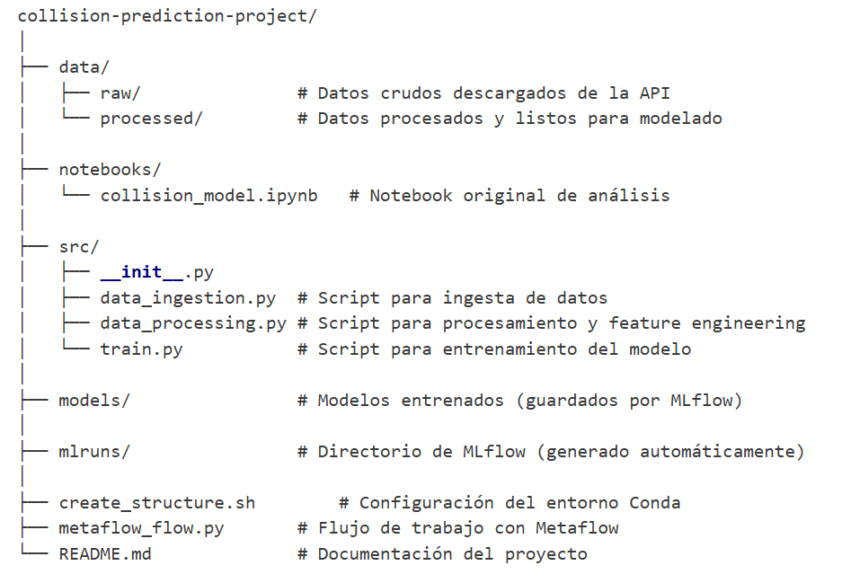

# ESPECIALIZACIÓN EN INTELIGENCIA ARTIFICAL
## OPERACIONES DE APRENDIZAJE AUTOMÁTICO I
### TRABAJO FINAL
#### Integrantes
    1. Corti, Gaston
    2. Castillo, Sebastian

# Proyecto de predicción de colisiones - Implementación local con MLFlow y Metaflow

## Estructura de carpetas del repositorio

collision-prediction-project/
│
├── data/
│   ├── raw/               # Datos crudos descargados de la API
│   └── processed/         # Datos procesados y listos para modelado
│
├── notebooks/
│   └── collision_model.ipynb   # Notebook original de análisis
│
├── src/
│   ├── __init__.py
│   ├── data_ingestion.py  # Script para ingesta de datos
│   ├── data_processing.py # Script para procesamiento y feature engineering
│   └── train.py           # Script para entrenamiento del modelo
│
├── models/                # Modelos entrenados (guardados por MLflow)
│
├── mlruns/                # Directorio de MLflow (generado automáticamente)
│
├── create_structure.sh        # Configuración del entorno Conda
├── metaflow_flow.py       # Flujo de trabajo con Metaflow
└── README.md              # Documentación del proyecto

# Ambiente

El ambiente se generó utilizando Conda con las siguientes dependencias

name: collision-prediction
channels:
  - conda-forge
  - defaults
dependencies:
  - python=3.11
  - pip
  - numpy
  - pandas
  - scikit-learn
  - matplotlib
  - requests
  - jupyter
  - pip:
    - mlflow
    - metaflow

# src scripts

01. data_ingestion.py

El script descarga datos de colisiones de tráfico desde una API pública de Los Ángeles en bloques, manejando errores y reintentos. Luego guarda los datos en formato JSON dentro del directorio data/raw.

02. data_processing.py

El script carga datos de colisiones desde un archivo JSON, los limpia y filtra para generar variables temporales específicas del área de Hollywood. Luego guarda los datos procesados en CSV y registra el proceso con MLflow para seguimiento de experimentos.

03. train.py

El script carga datos procesados desde un CSV generado previamente.
Divide los datos en entrenamiento y prueba sin mezclar el orden temporal (shuffle=False).
Entrena el modelo con 200 árboles y profundidad máxima de 10.
Registra el experimento en MLflow, incluyendo parámetros, métricas y artefactos como predicciones.
Guarda el modelo manualmente con joblib como respaldo, para reutilizarlo luego en predicciones o despliegue.

04. metaflow_flow.py

Este script define un flujo de trabajo para predecir colisiones usando Metaflow, ejecutando secuencialmente scripts de ingestión, procesamiento y entrenamiento. Si Metaflow no está disponible, corre los mismos pasos manualmente como alternativa. Además, maneja errores en cada etapa para asegurar que el flujo continúe.

    04.a El repositorio contiene datos de una ejecución:
        1. datos cruda en formato json CEIA_Operaciones_ML\collision-prediction-project\data\raw\la_collisions_raw.json
        2. data procesada en formato csv CEIA_Operaciones_ML\collision-prediction-project\data\processed\hollywood_collisions.csv
        3. resultados de experimento con mlflow CEIA_Operaciones_ML\collision-prediction-project\mlruns\1
        4. modelo backup en formato joblib CEIA_Operaciones_ML\collision-prediction-project\models\random_forest_model.joblib
        5. notebook original que fue el punto de partida del trabajo CEIA_Operaciones_ML\collision-prediction-project\notebooks\Collision_Model.ipynb